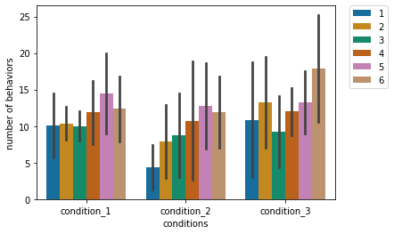
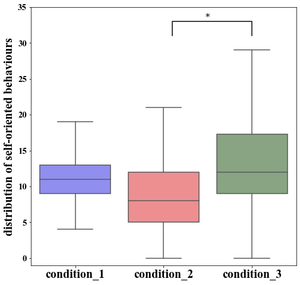

If you are working on a project with multiple authors (or writing an academic paper with others), using the most appropriate and clean way of data visualization to satisfy everyone’s need (and personal taste) might be challenging. 
Due to differences in background and experience, the way the topic of data visualization is approached, varies between the individuals. 
This caused some challenges with regards to non-reproducibility and accordingly, time-related issues during my PhD studies, which have motivated me to explore user-friendly (?) Python libraries for data visualization. 
Today we will check out [Seaborn](https://seaborn.pydata.org/), which is an alternative frontend for [matplotlib](https://matplotlib.org/), the de-facto standard for creating statistical graphics in Python.

In my day to day workflow, I like to explore my data together with the code I am writing in the context [Jupyter notebooks](https://jupyter.org/).
Jupyter notebooks provide a great interactive programming environment, while at the same time allowing for reproducibility (if used correctly).

For installing required packages, I recommend using [Pipenv](https://pipenv.pypa.io/en/latest/):
```bash
$ pipenv install pandas, seaborn, pingouin, jupyter
```

As usual, we import the necessary libraries and packages in the first cell of our notebook:

```python
import pandas as pd
import seaborn as sns
import matplotlib.pyplot as plt
import pingouin as pg
```
As a first step, we should take care of the data format. 
If the data was collected and subsequently organized by different people, it might look like *chaotic*. 
In some articles and blog posts it is mentioned, that the biggest part of data analysis is spent cleaning and preparing the data for the further processing. 
For better data organization, [tidy data format](https://vita.had.co.nz/papers/tidy-data.html), in which each variable has its own column and each observation has its own row, is suggested. 
A nice side effect of the tidy data format is the fact, that it is well supported by most statistical libraries.

In our example, we will use the tidy data format as seen below (table is shortend):

```python
df = pd.read_excel('dummy_data.xlsx')
df
```

|     | CONDITION   |   DAY |   pigeon_id |   behaviors |
|----:|:------------|------:|------------:|------------:|
|   0 | condition_1 |     1 |         229 |           9 |
|   1 | condition_1 |     1 |         252 |          19 |
|   2 | condition_1 |     1 |         257 |          11 |
|   3 | condition_1 |     1 |         395 |           5 |
|  11 | condition_2 |     1 |         395 |           2 |
|  12 | condition_2 |     1 |         539 |           7 |
|  13 | condition_2 |     1 |         543 |           4 |
|  14 | condition_2 |     1 |         598 |           9 |
|  20 | condition_3 |     1 |         539 |           1 |
|  21 | condition_3 |     1 |         543 |          10 |
|  22 | condition_3 |     1 |         598 |          22 |
|  23 | condition_3 |     1 |         868 |          23 |
|  24 | condition_1 |     2 |         229 |          12 |

In our example, as experiment subjects, pigeons received 3 conditions for 6 days and we recorded certain behaviours occurring in the experiment sessions. 

You might have chaotically organized data. 
[Pandas](https://pandas.pydata.org/) has solutions to reorganize your data, functions such as [`melt`](https://pandas.pydata.org/docs/reference/api/pandas.melt.html) and [`groupby`](https://pandas.pydata.org/pandas-docs/stable/reference/api/pandas.DataFrame.groupby.html) will help you to reshape your data into the tidy format.

The next step is deciding about the best ways to represent the data. 
If we are interested in seeing daily behavioural differences in conditions, we can use Seaborn's [`barplot`](https://seaborn.pydata.org/generated/seaborn.barplot.html) with defining the day as the `hue` parameter. 
Seaborn provides quite a lot of built-in [colour palettes](https://seaborn.pydata.org/tutorial/color_palettes.html), for which you can select the most appropriate ones for characteristics of your data and your visualization goals. 
I usually use the `colorblind` palette because of my target group (e.g. Kevin 🥸).
Another parameter that can be configured is the way error bars are calculated and displayed. 
If you use the default options, [confidence intervals](https://en.wikipedia.org/wiki/Confidence_interval) will be shown on the graphs. 
In our example, we draw it using [standart deviation](https://en.wikipedia.org/wiki/Standard_deviation) and therefore we define the parameter as `ci='sd'`.

I would highly recommend you to use the `order` parameter to decide the order of the values displayed on the x-axis. 
If you are not happy with the axis labels implicitly taken from the data, you can also set them explicitly. 
One last thing, if you have huge error bars, the default legend location inside the graph might be problematic, therefore you can override the location using `plt.legend`. 

```python
barplot = sns.barplot(x="CONDITION", y="behaviors", hue='DAY',palette="colorblind",data=df,ci='sd', 
            order = ['condition_1','condition_2','condition_3'])

barplot.set(xlabel='conditions',ylabel='number of behaviors')
plt.legend(bbox_to_anchor=(1.05, 1), loc=2, borderaxespad=0.)
```


For a publication, we should decide on the graph type which communicates main information most effectively. 
In our case, we see higher number of behaviours in `condition_3` compared to `condition_2`. 
To be sure about this tendency, we can first perform a two-way repeated-measures [ANOVA](https://en.wikipedia.org/wiki/Analysis_of_variance) to see the condition, day and their interaction effect and a subsequent [pairwise Tukey-HSD post-hoc test](https://pingouin-stats.org/generated/pingouin.pairwise_tukey.html) as multiple comparison test to check the difference between the conditions. 

```python
aov = pg.rm_anova(dv='behaviors',
                  within=['CONDITION','DAY'],
                  subject='pigeon_id', data=df)
display(aov)
```
|    | Source          |      SS |   ddof1 |   ddof2 |       MS |        F |      p-unc |   p-GG-corr |      np2 |      eps |
|---:|:----------------|--------:|--------:|--------:|---------:|---------:|-----------:|------------:|---------:|---------:|
|  0 | CONDITION       | 277.042 |       2 |      14 | 138.521  | 5.69891  | 0.015464   |   0.0258754 | 0.448772 | 0.772103 |
|  1 | DAY             | 599.229 |       5 |      35 | 119.846  | 4.19068  | 0.00433946 |   0.0172014 | 0.374479 | 0.611778 |
|  2 | CONDITION * DAY | 245.292 |      10 |      70 |  24.5292 | 0.981517 | 0.467437   |   0.415535  | 0.122974 | 0.272103 |

```python
df.pairwise_tukey(dv='behaviors', between='CONDITION').round(3)
```
|    | A           | B           |   mean(A) |   mean(B) |   diff |    se |      T |   p-tukey |   hedges |
|---:|:------------|:------------|----------:|----------:|-------:|------:|-------:|----------:|---------:|
|  0 | condition_1 | condition_2 |    11.542 |     9.396 |  2.146 | 1.191 |  1.802 |     0.17  |    0.365 |
|  1 | condition_1 | condition_3 |    11.542 |    12.75  | -1.208 | 1.191 | -1.015 |     0.569 |   -0.206 |
|  2 | condition_2 | condition_3 |     9.396 |    12.75  | -3.354 | 1.191 | -2.817 |     0.014 |   -0.57  |


In line with our former prediction, there is a significant difference between the conditions 3 and 2. 
To highlight this difference explicitly, we can use Seaborn's [`boxplot`](https://seaborn.pydata.org/generated/seaborn.boxplot.html).
Since some publications have certain requirements for the graphs, we can alter our figure size, the font type, label sizes using the global matplotlib parameter `plt.rcParams`. 
In our example, instead of using a built-in colour palette, I defined the colours using [hexadecimal colour codes](https://htmlcolorcodes.com/) and set the colour palette with these defined colours. 
It is also possible to see outlier observations as a default if you do not specify the `fliersize`.
In our example, we did not use `hue`, as we did in barplot, but keep in mind that boxplot also allows the usage of the `hue` argument. 
Similar to the barplot, we can also define labels, and limits for the y-axis. 
As a last thing, we can (manually) include the statistical annotation to highlight the significant difference between the conditions 2 and 3. 

```python
plt.rcParams['figure.figsize'] = [8, 8]
plt.rcParams["font.family"] = "Times New Roman"
plt.rcParams['ytick.labelsize'] = 15
plt.rcParams['xtick.labelsize'] = 20
plt.rcParams['axes.labelsize'] = 20

colors = ["#807fff", "#fd7f82", "#84a97e"]
sns.set_palette(sns.color_palette(colors))

boxplot = sns.boxplot(x="CONDITION", y='behaviors', data=df,
               order=['condition_1', 'condition_2', 'condition_3'], fliersize=0)

boxplot.set_xlabel("")
boxplot.set_ylabel("distribution of self-oriented behaviours")
boxplot.set_xticklabels(['condition_1', 'condition_2', 'condition_3'])
boxplot.set_ylim([-1, 35]) 

x2,x3 = 1, 2
y, h, col = df['behaviors'].max() + 2, 2, 'k'
plt.rcParams["font.family"] = "serif"
plt.plot([x2+0.1, x2+0.1, x3, x3], [y, y+h, y+h, y], lw=1.5, c=col)
plt.text((x2+x3)*.5, y+h, "*", fontsize=15, ha='center', va='bottom', color=col)
```


As you can see creating graphs using Python and Seaborn can be done even without having a background in software development or computer science.
A lot of good content and examples can be found online and I would advise everyone getting started to simply copy-paste code, change it, and see what happens. 
Stay tuned for more content from my side 🐦.